# Predicción de Incendios Forestales
Predicción de Incendios Forestales en Canadá mediante Aprendizaje Profundo.  
El objetivo es predecir la ocurrencia futura de incendios para el próximo año, dados diversos insumos del año anterior y del año actual.    
El problema de la predicción de incendios forestales se define aquí como un problema de segmentación semántica, lo que significa que a cada píxel se le asigna una probabilidad entre 0 y 1 de pertenecer a la clase fuego.  
El tipo de datos de entrada tiene un impacto en la extensión temporal elegida como entrada para el modelo.  
Por ejemplo, se utilizan datos de vegetación **anteriores** al período a predecir, mientras que los datos meteorológicos y cualquier dato que no se vea afectado por los incendios se toman del período a predecir.  
Como ejemplo, para predecir el período 2023, utilizamos datos de vegetación de 2022 y datos meteorológicos de 2023.  
El objetivo de este proyecto es demostrar el potencial del aprendizaje profundo en la predicción de incendios forestales en todo Canadá.   
El modelo desarrollado aquí sirve como prueba de concepto y aún no está totalmente optimizado; su objetivo es ofrecer conocimientos valiosos sobre cómo se pueden aplicar técnicas avanzadas de aprendizaje automático a la predicción de incendios forestales.  

# Resultados  
- A continuación se presentan algunos resultados preliminares de la primera versión del modelo.  
- Se utilizan 10 cuantiles para mapear el mapa de peligro predicho
- Resolución: 250 m/píxel (tanto para entrenamiento como para predicción)
- Períodos de entrenamiento: 2010-2022 (inclusivos)  
- <a href="https://www.comet.com/alexandrebrown/wildfire/7a153c0ed521439b89a1b5938bca5edc" 
      style="text-decoration: none; color: #0073e6;">
    Ver la ejecución de entrenamiento del modelo en CometML
  </a>  
- <a href="https://drive.google.com/file/d/15UuRywxd_Arvl2K7J1t1xAfFLwXDTYnB/view?usp=sharing"
    style="text-decoration: none; color: #0073e6;">
    Descargar Mapa de Predicción 2023
  </a>
- <a href="https://www.comet.com/api/asset/download?assetId=7768c6dc7db545a09d92f3dde8d76b8b&experimentKey=7a153c0ed521439b89a1b5938bca5edc"
    style="text-decoration: none; color: #0073e6;">
    Descargar Pesos del Modelo
  </a>
<table style="width:100%; border-collapse: collapse; text-align: center;">
  <thead>
    <tr>
      <th style="border: 1px solid #ddd; padding: 15px; background-color: #4CAF50; color: white; font-size: 18px; font-weight: bold;">
        Modelo UNet (modelo más reciente) Mapa de Peligro de Incendio Predicho 2023 (Conjunto de Prueba)
      </th>
      <th style="border: 1px solid #ddd; padding: 15px; background-color: #4CAF50; color: white; font-size: 18px; font-weight: bold;">
        Valor Real 2023 (Después del Control de Calidad)
      </th>
    </tr>
  </thead>
  <tbody>
    <tr>
      <td style="border: 1px solid #ddd; padding: 10px;">
        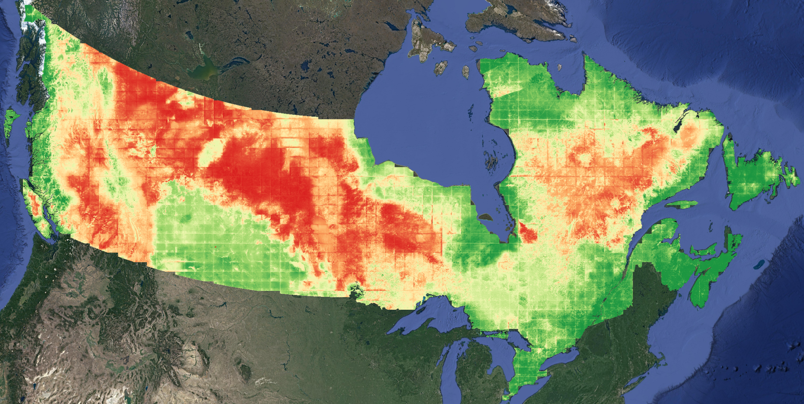
        <div style="margin-top: 10px; font-size: 14px;">
        </div>
      </td>
      <td style="border: 1px solid #ddd; padding: 10px;">
        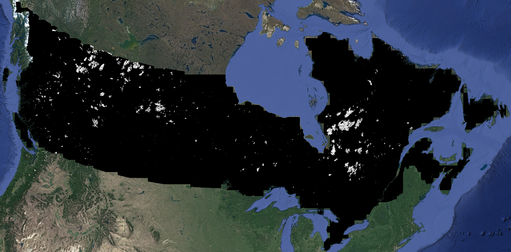
      </td>
    </tr>
  </tbody>
</table>
<table style="width:100%; border-collapse: collapse; text-align: center;">
  <thead>
    <tr>
      <th style="border: 1px solid #ddd; padding: 15px; background-color: #4CAF50; color: white; font-size: 18px; font-weight: bold;">
        Mapa de Peligro de Incendio Predicho
      </th>
      <th style="border: 1px solid #ddd; padding: 15px; background-color: #4CAF50; color: white; font-size: 18px; font-weight: bold;">
        Imagen Satelital
      </th>
    </tr>
  </thead>
  <tbody>
    <tr>
      <td style="border: 1px solid #ddd; padding: 10px;">
        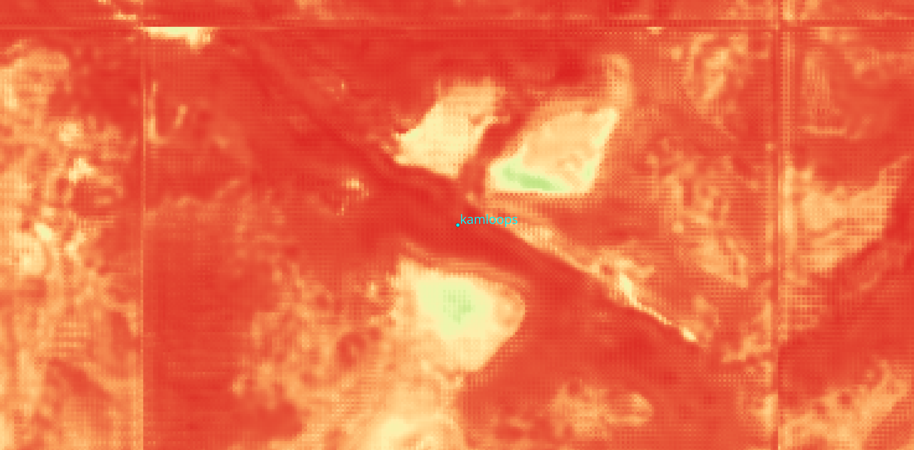
        </br>
        <div>
          Kamloops (área urbana con alta probabilidad esperada)
        </div>
      </td>
      <td style="border: 1px solid #ddd; padding: 10px;">
        
        </br>
        <div>
          Kamloops
        </div>
      </td>
    </tr>
    <tr>
      <td style="border: 1px solid #ddd; padding: 10px;">
        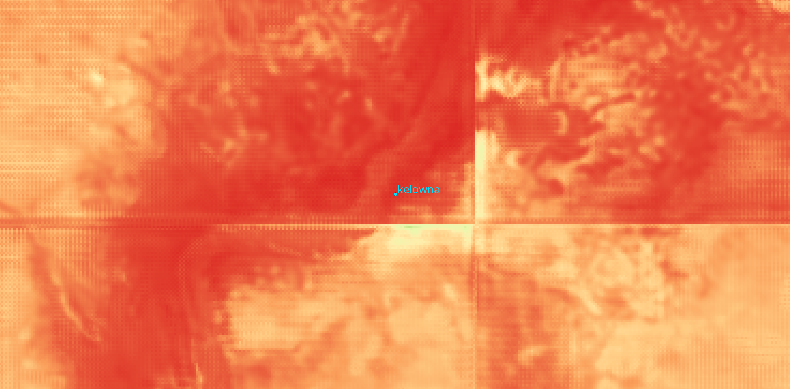
        </br>
        <div>
          Kelowna (área urbana con alta probabilidad esperada)
        </div>
      </td>
      <td style="border: 1px solid #ddd; padding: 10px;">
        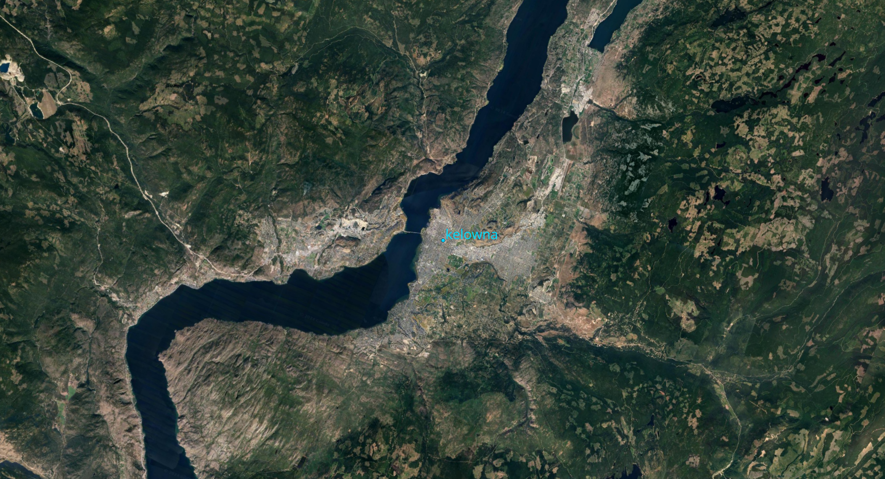
        </br>
        <div>
          Kelowna
        </div>
      </td>
    </tr>
    <tr>
      <td style="border: 1px solid #ddd; padding: 10px;">
        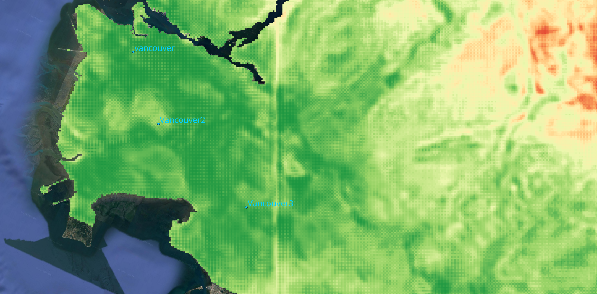
        </br>
        <div>
          Vancouver (área urbana con baja probabilidad esperada)
        </div>
      </td>
      <td style="border: 1px solid #ddd; padding: 10px;">
        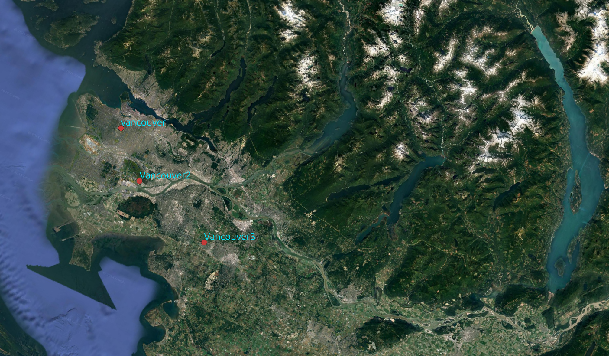
        </br>
        <div>
          Vancouver
        </div>
      </td>
    </tr>
  </tbody>
</table>


# Datos  
## Límites
- El límite de Canadá se utiliza para entrenar el modelo y generar predicciones 
  - Fuente: [Canada Boundary Shapefile](https://open.canada.ca/data/en/dataset/a883eb14-0c0e-45c4-b8c4-b54c4a819edb)  

## Datos de Entrada  
Los siguientes datos se utilizaron como entradas para el modelo.   
Cada dato de entrada se apila para crear los datos de entrada finales para el modelo.   
Para datos no directamente afectados por incendios (por ejemplo, datos meteorológicos), utilizamos datos del año actual, mientras que para datos afectados por incendios (por ejemplo, datos de vegetación), utilizamos datos del año anterior.   
Por ejemplo, para predecir incendios forestales en 2005, utilizamos datos meteorológicos de 2005 y datos de vegetación de 2004.

### Datos de Entrada Dinámicos  
Los datos de entrada dinámicos cambian con el tiempo y se actualizan en base diaria, semanal, quincenal, mensual o anual, dependiendo del conjunto de datos.

#### Datos de Vegetación
- **Índice de Vegetación de Diferencia Normalizada (NDVI)**  
  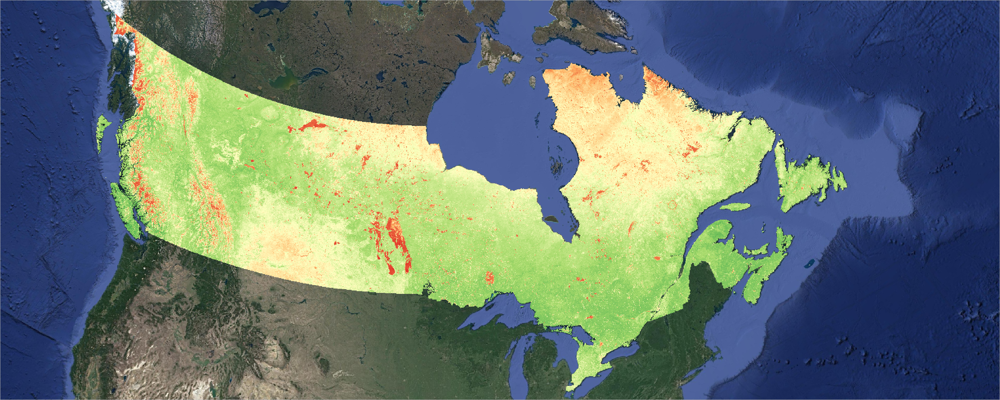  
  [MODIS/Terra Vegetation Indices 16-Day L3 Global 250 m SIN Grid](https://lpdaac.usgs.gov/products/mod13q1v061/)

- **Índice de Vegetación Mejorado (EVI)**  
  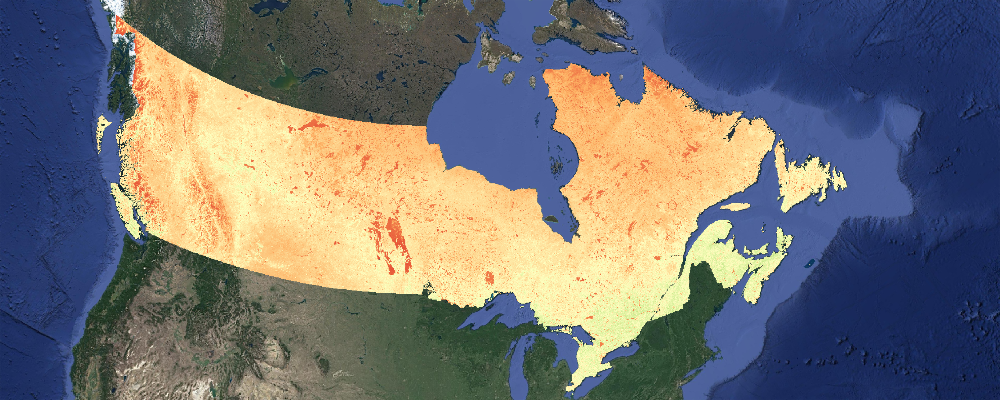  
  [MODIS/Terra Vegetation Indices 16-Day L3 Global 250 m SIN Grid](https://lpdaac.usgs.gov/products/mod13q1v061/)

- **Porcentaje de Cobertura de Árboles**  
  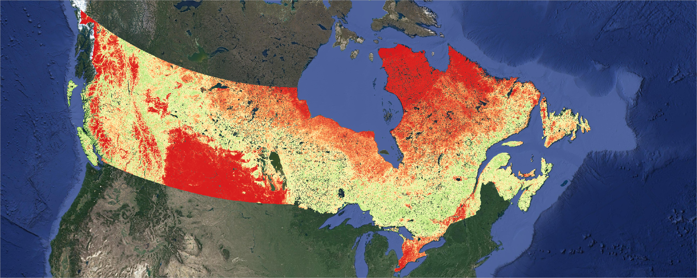  
  [MODIS/Terra Vegetation Continuous Fields Yearly L3 Global 250 m SIN Grid](https://lpdaac.usgs.gov/products/mod44bv061/)

- **Porcentaje de Vegetación No Arbórea**  
  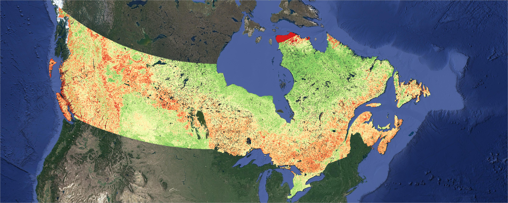  
  [MODIS/Terra Vegetation Continuous Fields Yearly L3 Global 250 m SIN Grid](https://lpdaac.usgs.gov/products/mod44bv061/)

- **Porcentaje de Superficie Sin Vegetación**  
  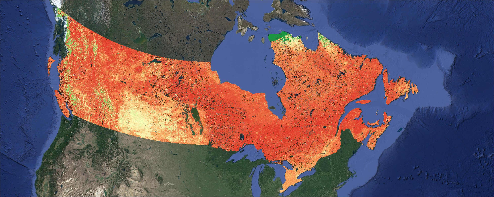  
  [MODIS/Terra Vegetation Continuous Fields Yearly L3 Global 250 m SIN Grid](https://lpdaac.usgs.gov/products/mod44bv061/)

- **Índice de Área Foliar (LAI)**  
  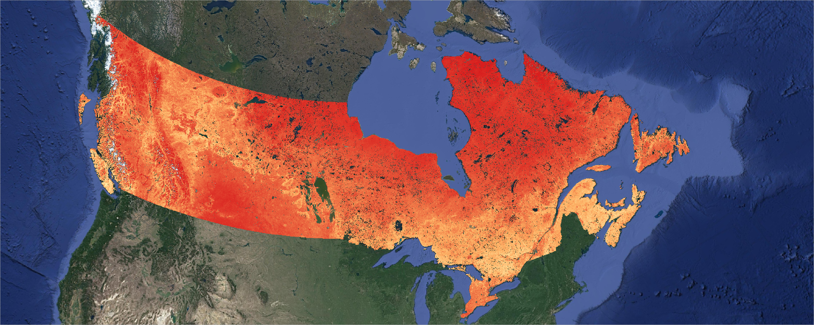  
  [MODIS/Terra Leaf Area Index/FPAR 8-Day L4 Global 500 m SIN Grid](https://lpdaac.usgs.gov/products/mod15a2hv061/)

#### Datos Meteorológicos
- **Componente U del Viento a 100 m**  
  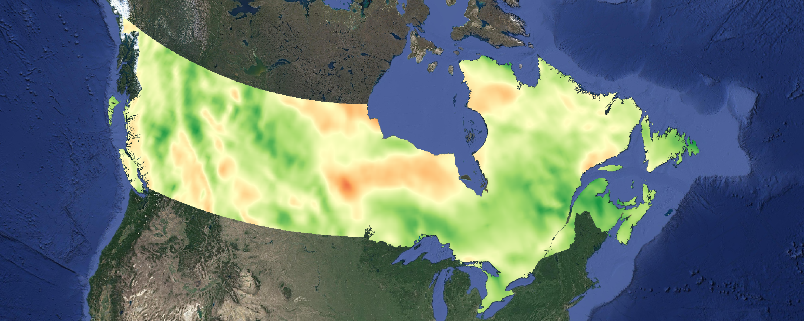  
  [ERA5 Reanalysis 100m U component of wind](https://codes.ecmwf.int/grib/param-db/228246)

- **Componente V del Viento a 100 m**  
  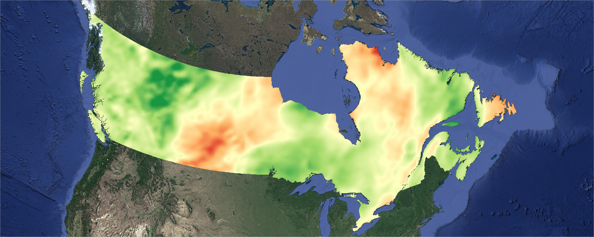  
  [ERA5 Reanalysis 100m V component of wind](https://codes.ecmwf.int/grib/param-db/132)

- **Temperatura a 2 m**  
  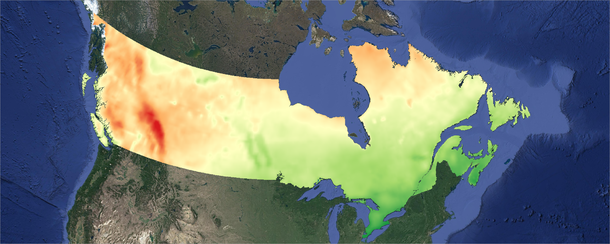  
  [ERA5 Reanalysis 2m Temperature](https://codes.ecmwf.int/grib/param-db/167)

- **Evaporación Potencial (PE)**  
  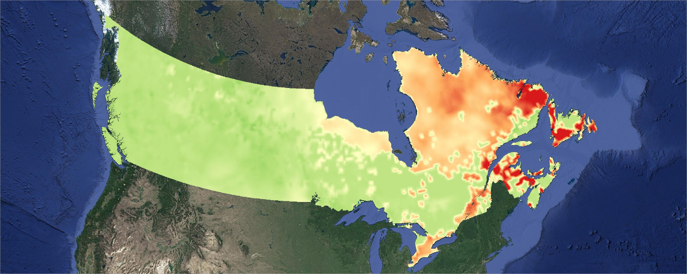  
  [ERA5 Reanalysis Potential evaporation](https://codes.ecmwf.int/grib/param-db/228251)

- **Radiación Solar Neta Superficial**  
  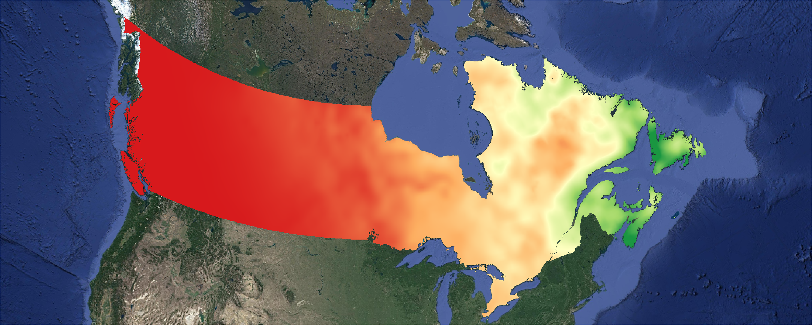  
  [ERA5 Reanalysis Surface net solar radiation](https://codes.ecmwf.int/grib/param-db/176)

- **Escorrentía Superficial**  
  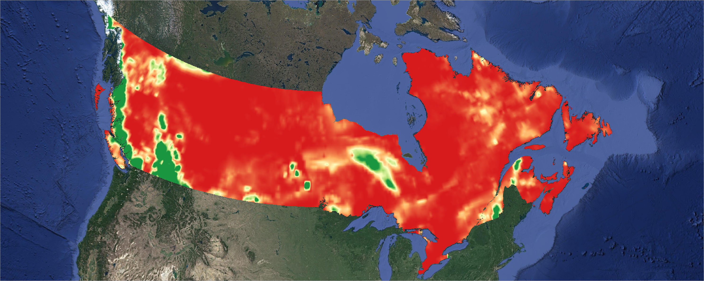  
  [ERA5 Reanalysis Surface runoff](https://codes.ecmwf.int/grib/param-db/8)

- **Precipitación Total (TP)**  
  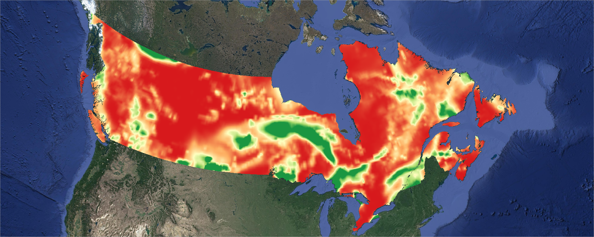  
  [ERA5 Reanalysis Total precipitation](https://codes.ecmwf.int/grib/param-db/228)

#### Datos de Incendio y Térmicos
- **Máscara de Incendio**  
  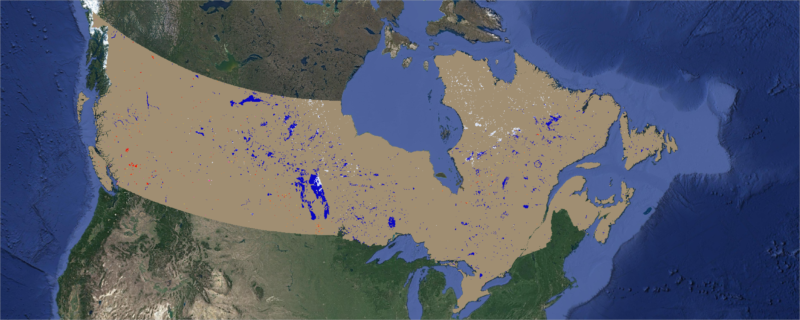  
  [MODIS/Terra Thermal Anomalies/Fire 8-Day L3 Global 1 km SIN Grid](https://lpdaac.usgs.gov/products/mod14a2v061/)

### Datos de Entrada Estáticos
Los datos de entrada estáticos no cambian con el tiempo o están disponibles como una sola instantánea temporal.

#### Datos de Elevación
- **Elevación (DEM)**  
  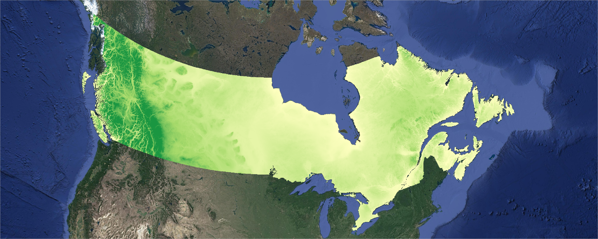  
  [NASA Shuttle Radar Topography Mission Global 3 arc second](https://lpdaac.usgs.gov/products/srtmgl3v003/)

#### Datos de Cuerpos de Agua
- **Cuerpos de Agua Permanentes**  
  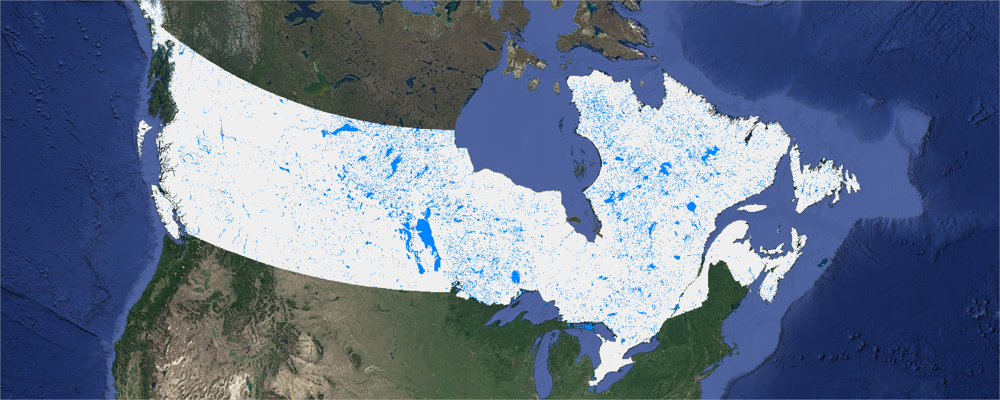  
  [Atlas of Canada National Scale Data 1:1,000,000 - Waterbodies](https://open.canada.ca/data/en/dataset/e9931fc7-034c-52ad-91c5-6c64d4ba0065)

### Agregación de Datos  
- Todos los datos que no tienen una base anual se agregan para tener una granularidad temporal anual.  

## Objetivo (Target)
- El objetivo del modelo son polígonos de incendio que representan la ocurrencia de incendios en un área específica en un momento dado.  
  - Fuente: [NBAC Canada Fire Polygons](https://cwfis.cfs.nrcan.gc.ca/datamart)
- Actualmente, el modelo se entrena para predecir la ocurrencia futura de incendios forestales para el próximo año.  
- Se asigna una probabilidad entre 0 y 1 a cada píxel, donde 1 significa que el modelo predijo que hay un 100% de probabilidad de que el área definida por este píxel se queme el próximo año.  

# Pipeline de Extremo a Extremo
## Prerrequisitos
### Conda/Micromamba
- Descargue e instale conda o micromamba (recomendado): https://mamba.readthedocs.io/en/latest/installation/micromamba-installation.html
#### Crear Entorno Virtual
- Cree un nuevo entorno utilizando el archivo `environment.yaml` de este repositorio (consulte [esta guía](https://mamba.readthedocs.io/en/latest/user_guide/micromamba.html#conda-yaml-spec-files)).
- Active su nuevo entorno (consulte [esta guía](https://mamba.readthedocs.io/en/latest/user_guide/micromamba.html#quickstarts)).

### Cuenta de NASA Earthdata
- Cree una cuenta: https://urs.earthdata.nasa.gov/users/new
- Esto es necesario para descargar los datos de NASA Earthdata.

### Cuenta CDS
- Cree una cuenta de ECMWF: https://accounts.ecmwf.int/auth/realms/ecmwf/login-actions/registration?client_id=cms-www&tab_id=vmMaA16DI6A
- Inicie sesión en CDS y configure su acceso a la API siguiendo esta guía: https://cds-beta.climate.copernicus.eu/how-to-api 
- Esto es necesario para descargar los datos ERA5.
- Acepte los términos de uso de los datos ERA5 (desplácese hasta la sección de términos de uso y haga clic en aceptar): https://cds-beta.climate.copernicus.eu/datasets/reanalysis-era5-single-levels-monthly-means?tab=download

## Pasos del Pipeline
### Descargar Datos
A continuación se muestra una descripción general de cómo se descargan los datos para cada fuente de datos y los diversos pasos involucrados (sin incluir la lógica de reanudación y detalles de bajo nivel):  
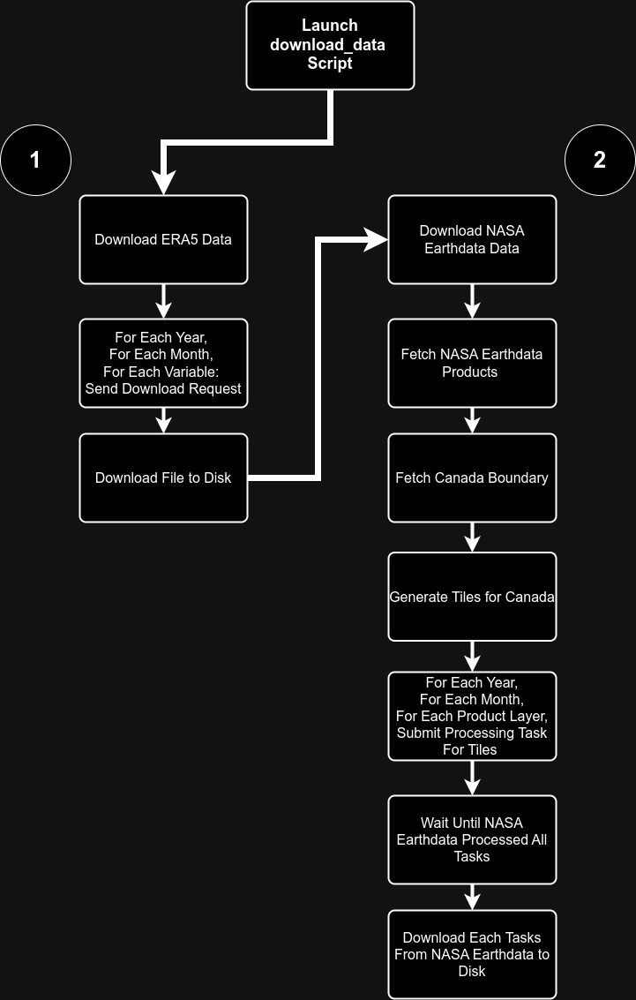
  
El primer paso del pipeline es descargar los datos que se utilizarán para entrenar el modelo.  
Para hacerlo, solo necesita ejecutar un script, **asegúrese de estar en la raíz de este repositorio en su terminal**.  
1. Configure las variables de entorno en una terminal:
   ```bash
   export NASA_EARTH_DATA_USER=<YOUR USERNAME>
   ```
   eg: `export NASA_EARTH_DATA_USER=alexandrebrown`  

   ```bash
   export NASA_EARTH_DATA_PASSWORD="<YOUR_PASSWORD>"
   ```
   eg: `export NASA_EARTH_DATA_PASSWORD="mypassword123"`  

   ```bash
   export PYTHONPATH=$(pwd)/src
   ```
2. Edite el archivo de configuración en `config/download_data.yaml` (o déjelo como está) para que coincida con lo que desea descargar (también puede dejar todo como está y solo cambiar el rango de año/mes).   


   Una cosa a tener en cuenta es que la ruta `logs.nasa_earth_data_logs_folder_path` debe ser `null` si no desea reanudar una ejecución anterior del script de descarga para NASA Earthdata **o si es la primera vez que ejecuta el script**. Si ejecutó el script `download_data` pero ocurrió un problema (por ejemplo: los servidores de NASA se apagaron), verifique en la carpeta `logs/` la ruta al archivo de registro generado automáticamente. Puede pasar la ruta de la carpeta de registro para reanudar desde ella (por ejemplo: `logs/download_data/20240711-081839` reanudará utilizando el archivo de registro dentro de `logs/download_data/20240711-081839`).  

   Para obtener más información sobre la API de NASA Earthdata y lo que significan productos y capas, consulte el cuaderno en `experiments/explore_nasa_earth_data.ipynb`.  

   Cada producto puede tener una o más capas; la configuración de `download_data` nos permite especificar qué productos y qué capas de cada producto descargar. El nombre de la capa debe coincidir exactamente con el nombre de la capa (consulte el cuaderno de exploración para obtener más detalles sobre cómo obtener este valor).  
3. Ejecute el script `download_data`:  
   ```bash
   python download_data.py
   ```
   Nota: Si ocurrió un error durante la ejecución (por ejemplo: el servidor de terceros se apagó/la descarga falló), puede evitar volver a enviar solicitudes de procesamiento que ya se enviaron antes del fallo. Para hacerlo, busque en `logs/download_data`, copie la ruta de la carpeta generada y coloque esta ruta en `logs.nasa_earth_data_logs_folder_path`.  
   Por ejemplo, si tengo lo siguiente: `logs/download_data/20240711-081839` de mi ejecución anterior, actualizaría `config/download_data.yaml` para que tenga:  
   ```yaml
    logs:
      nasa_earth_data_logs_folder_path: "logs/download_data/20240711-081839/"
   ```

Esto descargará los datos basándose en su configuración `config/download_data.yaml`.  
Las fuentes de datos actuales compatibles son:  
- era5
- nasa_earth_data
- gov_can

### Generar Conjunto de Datos
Una vez descargados los datos crudos, estos deben procesarse porque algunos datos pueden ser diarios, otros quincenales o mensuales, y algunas fuentes de datos pueden devolver mosaicos mientras que otras pueden devolver un solo archivo para todo Canadá.  
El objetivo de este paso es tomar todos los datos descargados y producir como salida mosaicos de la resolución deseada y agregados anualmente.   
A continuación se presenta una descripción general de los diversos pasos (a alto nivel):   

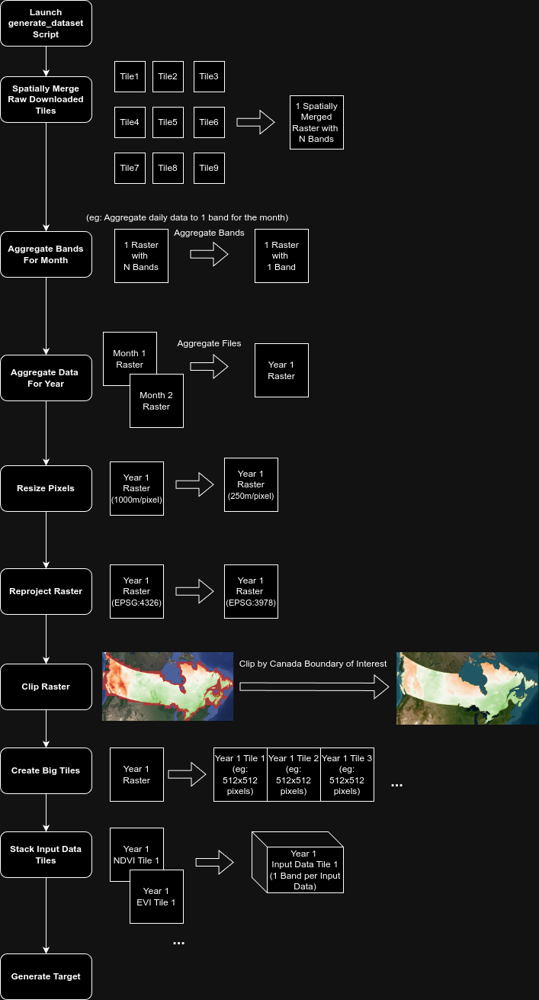  

Tenga en cuenta que este paso genera mosaicos grandes y estos suelen ser más grandes que los mosaicos que el modelo tomará como entrada. Esto se hizo para asegurarnos de dividir nuestros datos de entrenamiento/validación de una manera que evite la fuga de datos. Se crearán mosaicos más pequeños (por ejemplo: 128x128) durante el entrenamiento basándose en los mosaicos grandes.  
Cada mosaico grande tiene una dimensión C x H x W donde C es el número de diferentes fuentes de datos (por ejemplo: NDVI, EVI, LAI, ...), H = 512 y W = 512.  
Por lo tanto, cada mosaico grande representa las entradas de datos apiladas para 1 año para el área delimitada por la zona de 512x512 píxeles. 

1. Agregue el código fuente del repositorio a la ruta de Python (asegúrese de estar en la raíz del repositorio):  
    ```bash
    export PYTHONPATH=$(pwd)/src
    ```
1. Edite la configuración (o déjela como está) en `config/generate_dataset.yaml`.   
    - Se puede cambiar la resolución del tamaño de píxel (por ejemplo: 250 metros), el tamaño del mosaico en píxeles (por ejemplo: 512x512).
    - Los nombres de las fuentes deben coincidir con el nombre de la carpeta creada durante el paso de descarga. 
1. Ejecute el script de generación del conjunto de datos:  
    ```bash
    python generate_dataset.py
    ```
#### Reanudar desde la carpeta tmp
Podemos reanudar la generación del conjunto de datos configurando `resume: true` en la configuración y estableciendo `resume_folder_path` como una cadena que representa la ruta a la carpeta del conjunto de datos para reanudar (por ejemplo: `"data/datasets/16f47c6b-fff0-424e-b5b5-b55ad6137cee"`).  
La reanudación espera que todos los datos bajo la carpeta `tmp` de `resume_folder_path` tengan datos válidos que hayan terminado de procesarse.  
Para los datos de entrada dinámicos, esto significa que todos los datos deben estar bajo `resume_folder_path/tmp/year_1/input_data_1/tiles/` (para todos los años y todos los datos de entrada).  
Para los datos de entrada estáticos, deben estar bajo `resume_folder_path/tmp/static_data/input_data_1/tiles/`.  
La generación del conjunto de datos reconstruirá su índice basándose en esta suposición.  
Esto significa que se pueden ejecutar múltiples veces el script de generación del conjunto de datos (por ejemplo: generar para el año 1 y luego volver a ejecutar el script para el año 2) y luego combinar el contenido de la carpeta `tmp` de ambos años para reanudar la generación del conjunto de datos como si ambos años se hubieran computado en la misma ejecución.  
La lógica de reanudación reanuda justo antes del paso de **apilamiento (stacking)** en la generación del conjunto de datos (lo cual es seguido por la generación del objetivo).    
Nota: Asegúrese de configurar la opción `cleanup_tmp_folder_on_success: false` para mantener la carpeta `tmp` y poder reanudar desde ella.  
Nota 2: Si no desea conservar los datos temporales para reanudar la generación del conjunto de datos, puede establecer `cleanup_tmp_folder_on_success: true`; esto eliminará los datos temporales si la generación del conjunto de datos tiene éxito.  


### Dividir Conjunto de Datos
1. Agregue el código fuente del repositorio a la ruta de Python (asegúrese de estar en la raíz del repositorio):  
    ```bash
    export PYTHONPATH=$(pwd)/src
    ```
1. Establezca la variable de entorno `PROJ_LIB` en su entorno de conda: 
    ```shell
    export PROJ_LIB="$CONDA_PREFIX/share/proj/"
    ```
1. Actualice el archivo de configuración `config/split_dataset.yaml` para especificar dónde están los datos:  
    - Establezca `data.input_data_periods_folders_paths` en una lista de cadenas que correspondan a las rutas de la carpeta para el rango de los datos de entrada (por ejemplo: '.../2023_2023').  
      - Esta lista es la lista de todos los períodos (no solo entrenamiento).
    - Haga lo mismo para `data.target_periods_folders_paths`

1. Ejecute el script de división:  
    ```shell
    python split_dataset.py
    ```
  
Nota: El script generará un archivo json llamado `data_split_info.json` dentro del directorio de salida de la división de datos. Este archivo es utilizado por el script de entrenamiento para cargar los datos, así que tome nota de su ubicación.

#### Calidad de los Datos 
Actualmente, la configuración predeterminada está configurada para realizar las siguientes comprobaciones de calidad de datos:  
- `min_percent_pixels_with_valid_data: 0.50`  
    - Esto eliminará los mosaicos del conjunto de entrenamiento/validación/prueba que no contengan al menos el 50% de sus píxeles como "píxeles válidos".
    - Esto se hizo para asegurar que el modelo no se ajuste al ruido (por ejemplo: mosaicos que consisten solo en ruido o principalmente en ruido).
    - Esto también se aplicó a los conjuntos de validación y prueba para asegurar que calculemos métricas basadas únicamente en datos válidos.
- `input_data_min_fraction_of_bands_with_valid_data: 0.5`
    - Esto tratará cualquier píxel que no tenga al menos el 50% de su banda con valores válidos como un píxel no válido.
    - Valores válidos significa que no son valores de nodata.
- `max_no_fire_proportion: 0.0`
    - Esto eliminará del conjunto de entrenamiento (solo), cualquier mosaico cuyo objetivo consista únicamente en 0.  
    - Esto ayuda a combatir la naturaleza altamente desequilibrada de los datos para los incendios forestales.
    - La proporción = 0.0 significa que no permitimos ningún mosaico con solo píxeles sin incendio; 0.1 significaría que permitimos como máximo el 10% de los mosaicos con solo 0 como objetivo.
- `min_nb_pixels_with_fire_per_tile: 256`
    - Esto eliminará los mosaicos del conjunto de entrenamiento (solo), que no tengan al menos 256 píxeles con un objetivo = 1.
    - Esto ayuda a combatir la naturaleza altamente desequilibrada de los datos para los incendios forestales. 

### Entrenamiento
1. Agregue el código fuente del repositorio a la ruta de Python (asegúrese de estar en la raíz del repositorio):  
    ```bash
    export PYTHONPATH=$(pwd)/src
    ```
1. Actualice el archivo de configuración `config/train.yaml` para especificar dónde está el archivo data_split_info:  
    - Establezca `data.split_info_file_path` en una cadena que represente la ruta del archivo json.

1. Configure los registradores si es necesario (consulte [loggers](#loggers))

1. Ejecute el script de entrenamiento:  
    ```shell
    python train.py
    ```
  
Nota: El script genera los resultados de entrenamiento en la carpeta de salida.

#### Loggers
La configuración de entrenamiento admite los siguientes registradores:  
- [loguru](#loguru)
- [cometml](#comet-ml)  
##### Loguru  
https://github.com/Delgan/loguru  
No se requiere configuración, imprimirá en `std.out`.  

##### Comet ML  
https://www.comet.com/site/  
1. Establezca las siguientes variables de entorno **antes** de ejecutar el script de entrenamiento:    
    ```bash
    export COMET_ML_API_KEY=<YOUR_API_KEY>
    ```
    ```bash
    export COMET_ML_PROJECT_NAME=<YOUR_PROJECT>
    ```
    ```bash
    export COMET_ML_WORKSPACE=<YOUR_WORKSPACE>
    ```

### Predicción
1. Agregue el código fuente del repositorio a la ruta de Python (asegúrese de estar en la raíz del repositorio):  
    ```bash
    export PYTHONPATH=$(pwd)/src
    ```
1. Actualice el archivo de configuración `config/predict.yaml` para especificar dónde está el archivo data_split_info:  
    - Establezca `data.split_info_file_path` en una cadena que represente la ruta del archivo json.

1. Actualice el archivo de configuración `config/predict.yaml` para especificar dónde están los datos de entrada:
    - Establezca `data.input_data_folder_path` en una cadena que represente la ruta a la carpeta input_data

1. Ejecute el script de predicción:  
    ```shell
    python predict.py
    ```
  
Nota: El script genera 1 archivo raster que corresponde al mapa de predicción donde a cada píxel se le asigna una probabilidad de ocurrencia futura de incendios forestales. Puede que desee agregar 0 como valor de nodata en QGIS al visualizar el mapa predicho.  

# Modelo de Aprendizaje Profundo
- El repositorio incluye una implementación personalizada de una [Red Neuronal Convolucional U-Net](https://arxiv.org/abs/1505.04597).  
- A continuación se muestra un gráfico de la arquitectura UNet codificada en este repositorio, que se desvía ligeramente del artículo para producir una salida que tenga el mismo tamaño que la imagen de entrada:  
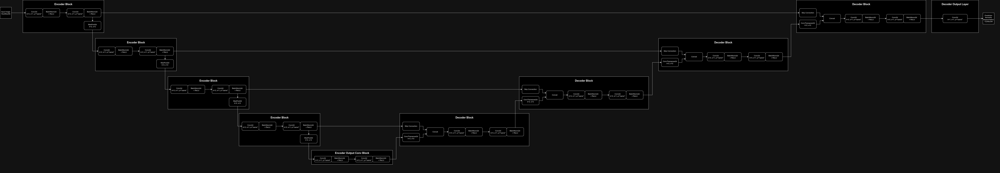 

# Contribuir  
1. Siga los pasos de los [prerrequisitos](#prerequisites).
1. [Descargar e instalar el binario Trufflehog](https://github.com/trufflesecurity/trufflehog/releases/tag/v3.81.8)
1. Instalar hooks de pre-commit  
    ```bash
    pre-commit install --allow-missing-config
    ```  
1. Actualice `.vscode/settings.json` `mypy.dmypyExecutable` para que apunte al binario según la ubicación de su entorno de conda (actualmente asume que usa micromamba y tiene un entorno llamado `wildfire` bajo `/home/user/micromamba/envs/wildfire/`)
