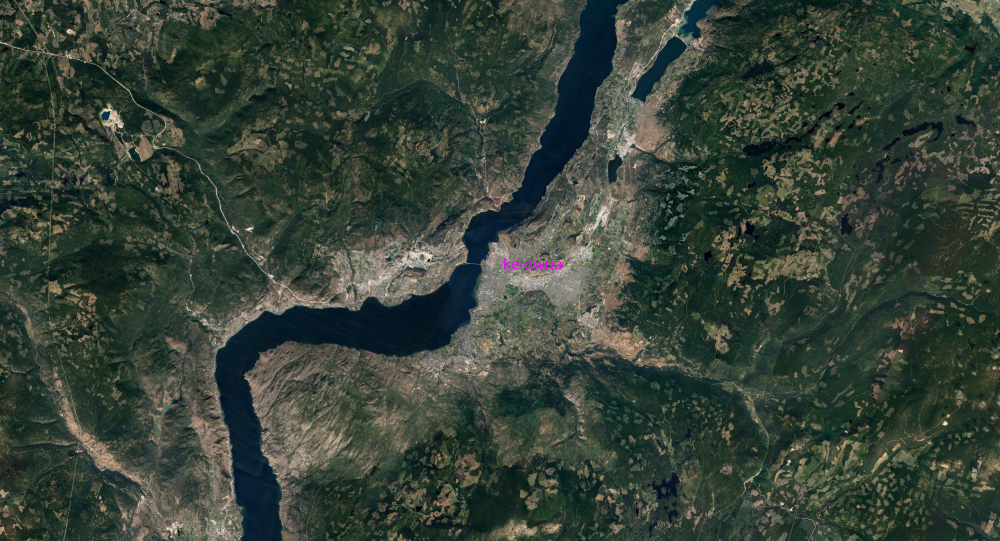
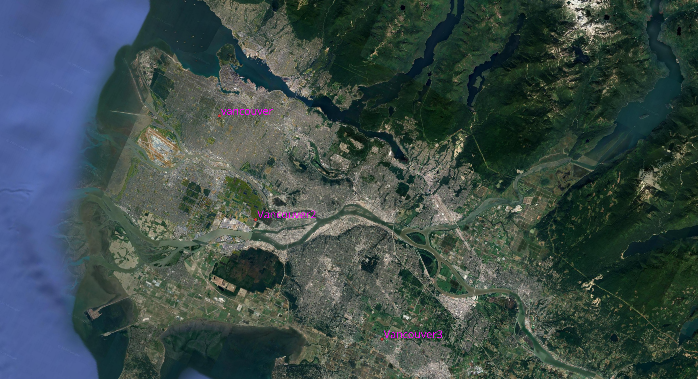
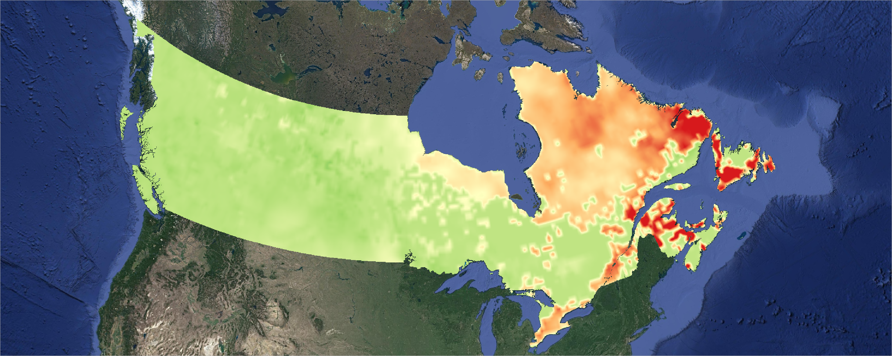

# Wildfire Prediction
Canada Wildfire Prediction Using Deep Learning.  
The objective is to predict the future fire occurrences for the next year given various inputs from the past year and current year.    
The problem of wildfire prediction is defined as semantic segmentation problem here meaning each pixel is assigned a probability between 0 and 1 of being the class fire.  
The type of input data has an impact on the temporal extent chosen as input to the model.  
For instance, vegetation data **prior** to the period to predict is used while weather data and any data that is not affected by fires is taken from the period to predict.  
As an example, to predict the period 2023, we use vegetation data from 2022 and weather data from 2023.  
The objective of this project is to demonstrate the potential of deep learning in predicting wildfires across Canada.   
The model developed here serves as a proof of concept and is not yet fully optimized, its goal is to offer valuable insights into how advanced machine learning techniques can be applied to wildfire prediction.  

# Results  
- Below are some preliminary results on the first version of the model.  
- Using 10 Quantilese to map the predicted hazard map
- Resolution : 250m/pixel (for both training & predicting)
- Training periods : 2010-2021 (inclusively)  
- <a href="https://www.comet.com/alexandrebrown/wildfire/5d02d63ab21f4abc900bc471d612aaee" 
      style="text-decoration: none; color: #0073e6;">
    View the model training run on CometML
  </a>  
- <a href="https://drive.google.com/file/d/1Gw3FJErxcgdEVmIsYlQV_O7Uxu5OUaX9/view?usp=sharing"
    style="text-decoration: none; color: #0073e6;">
    Download 2023 Prediction Map
  </a>
- <a href="https://www.comet.com/api/asset/download?assetId=92ef0945f47c4d09bc0b5c4c1743bacf&experimentKey=5d02d63ab21f4abc900bc471d612aaee"
    style="text-decoration: none; color: #0073e6;">
    Download Model Weights
  </a>
<table style="width:100%; border-collapse: collapse; text-align: center;">
  <thead>
    <tr>
      <th style="border: 1px solid #ddd; padding: 15px; background-color: #4CAF50; color: white; font-size: 18px; font-weight: bold;">
        UNet Model (latest model) 2023 Predicted Fire Hazard Map (Test Set)
      </th>
      <th style="border: 1px solid #ddd; padding: 15px; background-color: #4CAF50; color: white; font-size: 18px; font-weight: bold;">
        2023 Ground Truth (After QC)
      </th>
    </tr>
  </thead>
  <tbody>
    <tr>
      <td style="border: 1px solid #ddd; padding: 10px;">
        
        <div style="margin-top: 10px; font-size: 14px;">
        </div>
      </td>
      <td style="border: 1px solid #ddd; padding: 10px;">
        
      </td>
    </tr>
  </tbody>
</table>
<table style="width:100%; border-collapse: collapse; text-align: center;">
  <thead>
    <tr>
      <th style="border: 1px solid #ddd; padding: 15px; background-color: #4CAF50; color: white; font-size: 18px; font-weight: bold;">
        Predicted Fire Hazard Map
      </th>
      <th style="border: 1px solid #ddd; padding: 15px; background-color: #4CAF50; color: white; font-size: 18px; font-weight: bold;">
        Satellite Image
      </th>
    </tr>
  </thead>
  <tbody>
    <tr>
      <td style="border: 1px solid #ddd; padding: 10px;">
        
        </br>
        <div>
          Kamloops (city area with expected high probability)
        </div>
      </td>
      <td style="border: 1px solid #ddd; padding: 10px;">
        
        </br>
        <div>
          Kamloops
        </div>
      </td>
    </tr>
    <tr>
      <td style="border: 1px solid #ddd; padding: 10px;">
        
        </br>
        <div>
          Kelowna (city area with expected high probability)
        </div>
      </td>
      <td style="border: 1px solid #ddd; padding: 10px;">
        
        </br>
        <div>
          Kelowna
        </div>
      </td>
    </tr>
    <tr>
      <td style="border: 1px solid #ddd; padding: 10px;">
        
        </br>
        <div>
          Vancouver (city area with expected low probability)
        </div>
      </td>
      <td style="border: 1px solid #ddd; padding: 10px;">
        
        </br>
        <div>
          Vancouver
        </div>
      </td>
    </tr>
  </tbody>
</table>


# Data  
## Boundaries
- The boundary of Canada is used to train the model and to generate predictions 
  - Source : [Canada Boundary Shapefile](https://open.canada.ca/data/en/dataset/a883eb14-0c0e-45c4-b8c4-b54c4a819edb)  

## Input Data  
The following data were used as inputs for the model.   
Each input data is stacked to create the final input data for the model.   
For data not directly affected by fires (e.g., weather data), we use data from the current year, while for data affected by fires (e.g., vegetation data), we use data from the previous year.   
For example, to predict wildfires in 2005, we use weather data from 2005 and vegetation data from 2004.

### Dynamic Input Data  
Dynamic input data changes over time and is updated on a daily, weekly, bi-weekly, monthly, or yearly basis, depending on the dataset.

#### Vegetation Data
- **Normalized Difference Vegetation Index (NDVI)**  
    
  [MODIS/Terra Vegetation Indices 16-Day L3 Global 250 m SIN Grid](https://lpdaac.usgs.gov/products/mod13q1v061/)

- **Enhanced Vegetation Index (EVI)**  
    
  [MODIS/Terra Vegetation Indices 16-Day L3 Global 250 m SIN Grid](https://lpdaac.usgs.gov/products/mod13q1v061/)

- **Percent Tree Cover**  
    
  [MODIS/Terra Vegetation Continuous Fields Yearly L3 Global 250 m SIN Grid](https://lpdaac.usgs.gov/products/mod44bv061/)

- **Percent Non-Tree Vegetation**  
    
  [MODIS/Terra Vegetation Continuous Fields Yearly L3 Global 250 m SIN Grid](https://lpdaac.usgs.gov/products/mod44bv061/)

- **Percent Non-Vegetated**  
    
  [MODIS/Terra Vegetation Continuous Fields Yearly L3 Global 250 m SIN Grid](https://lpdaac.usgs.gov/products/mod44bv061/)

- **Leaf Area Index (LAI)**  
    
  [MODIS/Terra Leaf Area Index/FPAR 8-Day L4 Global 500 m SIN Grid](https://lpdaac.usgs.gov/products/mod15a2hv061/)

#### Weather Data
- **100m U Component of Wind**  
    
  [ERA5 Reanalysis 100m U component of wind](https://codes.ecmwf.int/grib/param-db/228246)

- **100m V Component of Wind**  
    
  [ERA5 Reanalysis 100m V component of wind](https://codes.ecmwf.int/grib/param-db/132)

- **2m Temperature**  
    
  [ERA5 Reanalysis 2m Temperature](https://codes.ecmwf.int/grib/param-db/167)

- **Potential Evaporation (PE)**  
    
  [ERA5 Reanalysis Potential evaporation](https://codes.ecmwf.int/grib/param-db/228251)

- **Surface Net Solar Radiation**  
    
  [ERA5 Reanalysis Surface net solar radiation](https://codes.ecmwf.int/grib/param-db/176)

- **Surface Runoff**  
    
  [ERA5 Reanalysis Surface runoff](https://codes.ecmwf.int/grib/param-db/8)

- **Total Precipitation (TP)**  
    
  [ERA5 Reanalysis Total precipitation](https://codes.ecmwf.int/grib/param-db/228)

#### Fire and Thermal Data
- **Fire Mask**  
    
  [MODIS/Terra Thermal Anomalies/Fire 8-Day L3 Global 1 km SIN Grid](https://lpdaac.usgs.gov/products/mod14a2v061/)

### Static Input Data
Static input data does not change over time or is available as a single time slice.

#### Elevation Data
- **Elevation (DEM)**  
    
  [NASA Shuttle Radar Topography Mission Global 3 arc second](https://lpdaac.usgs.gov/products/srtmgl3v003/)

#### Water Bodies Data
- **Permanent Water Bodies**  
    
  [Atlas of Canada National Scale Data 1:1,000,000 - Waterbodies](https://open.canada.ca/data/en/dataset/e9931fc7-034c-52ad-91c5-6c64d4ba0065)

### Data Aggregation  
- All the data that is not already yearly based is aggregated to have a yearly temporal granularity.  

## Target  
- The target of the model is fire polygons which represent fire occurrence for a specific area at a given time.  
  - Source : [NBAC Canada Fire Polygons](https://cwfis.cfs.nrcan.gc.ca/datamart)
- Currently the model is trained to predict the future wildfire occurrences for the next year.  
- A probability between 0 and 1 is assigned to each pixel where 1 means the model predicted that there is a 100% probability that the area defined by this pixel will burn in the next year.  

# End-To-End Pipeline
## Prerequisites
### Conda/Micromamba
- Download and install conda or micromamba (recommended) : https://mamba.readthedocs.io/en/latest/installation/micromamba-installation.html
#### Create Virtual Environment
- Create a new environment using the `environment.yaml` file from this repository (see [this guide](https://mamba.readthedocs.io/en/latest/user_guide/micromamba.html#conda-yaml-spec-files)).
- Activate your new environment (see [this guide](https://mamba.readthedocs.io/en/latest/user_guide/micromamba.html#quickstarts)).

### NASA Earthdata Account
- Create an account : https://urs.earthdata.nasa.gov/users/new
- This is required to download the NASA Earthdata data.

### CDS Account
- Create an ECMWF Account : https://accounts.ecmwf.int/auth/realms/ecmwf/login-actions/registration?client_id=cms-www&tab_id=vmMaA16DI6A
- Login to CDS and setup your API access following this guide : https://cds-beta.climate.copernicus.eu/how-to-api 
- This is required to download the ERA5 data.
- Accept the terms of use for the ERA5 data (scroll down to terms of use section and click accept) : https://cds-beta.climate.copernicus.eu/datasets/reanalysis-era5-single-levels-monthly-means?tab=download

## Pipeline Steps
### Download Data
Here is an overview of how the data is download for each data source and the various steps involved (not including resume logic and low level details) :  

  
The first step of the pipeline is to download the data that will be used for training the model.  
To do so, one only needs to execute one script, **make sure you are at the root of this repository in your terminal**.  
1. Setup environment variables in a terminal :
   ```bash
   export NASA_EARTH_DATA_USER=<YOUR USERNAME>
   ```
   eg: `export NASA_EARTH_DATA_USER=alexandrebrown`  

   ```bash
   export NASA_EARTH_DATA_PASSWORD="<YOUR_PASSWORD>"
   ```
   eg: `export NASA_EARTH_DATA_PASSWORD="mypassword123"`  

   ```bash
   export PYTHONPATH=$(pwd)/src
   ```
2. Edit the configuration file under `config/download_data.yaml` (or leave as-is) so that you it matches what you want to download (you can also leave everything as-is and only change the year/month range).   

   One thing to note is that the `logs.nasa_earth_data_logs_folder_path` path must be `null` if you do not wish to resume a previous execution of the download script for the NASA Earthdata **or if it is your first time running the script**. If you executed the download_data script but an issue occurred (eg: NASA servers went down), check under the `logs/` folder for the path to the auto-generated log file. You can pass in the path to the log folder to resume from it (eg: `logs/download_data/20240711-081839` will resume using the log file inside `logs/download_data/20240711-081839`).  

   To learn more about NASA Earthdata API and what products and layers mean, see the notebook under `experiments/explore_nasa_earth_data.ipynb`.  

   Each product can have one or more layers, the download_data config allows us to specify which products and which layers from each product to download. The layer name must match the exact layer name (see the exporation notebook for more details on how to get this value).  
3. Run the `download_data` script :  
   ```bash
   python download_data.py
   ```
   Note : If an error occurred during the execution (eg: third party server went down/download failed), you can avoid re-submitting processing requests that were already sent before the crash. To do so, look under `logs/download_data` and copy the path to the folder that was generated and put this path under `logs.nasa_earth_data_logs_folder_path`.  
   For instance, if I have the following : `logs/download_data/20240711-081839` from my previous execution, then I would update the `config/download_data.yaml` to have :  
   ```yaml
    logs:
      nasa_earth_data_logs_folder_path: "logs/download_data/20240711-081839/"
   ```

This will download the data based on your `config/download_data.yaml` configuration.  
The current data sources that are supported are :  
- era5
- nasa_earth_data
- gov_can

### Generate Dataset
Once the raw data has been downloaded, the data needs to be processed because some data might be daily, some might be bi-weekly or monthly and some data sources might return tiles while some might return one file for the entire Canada.  
The goal of this step is to take all the data that was downloaded and produce as output tiles of the desired resolution and aggregated yearly.   
Here is an overview of the various steps (at a high level) :   

  

Note that this step outputs big tiles and these tiles are usually larger than the tiles that the model will take as input. This was done to ensure that we split our train/val data in a way that avoids leakage. Smaller tiles (eg: 128x128) will be created during training based on the big tiles.  
Each big tile is of dimension C x H x W where = C the number of different sources of data (eg: NDVI, EVI, LAI, ...), H = 512 and W = 512.  
So each big tile represents the data inputs stacked for 1 year for the area delimited by the 512x512 pixels area. 

1. Add the repo source code to the python path (make sure you are at the root of the repository) :  
    ```bash
    export PYTHONPATH=$(pwd)/src
    ```
1. Edit the configuration (or leave as-is) under `config/generate_dataset.yaml`.   
    - One can change the pixel size resolution (eg: 250 meters), tile size in pixels (eg: 512x512).
    - The sources names must match the folder name created during the download step. 
1. Execute the dataset generation script :  
    ```bash
    python generate_dataset.py
    ```
#### Resume from tmp folder
We can resume dataset generation by setting `resume: true` in the config and setting the `resume_folder_path` to a string representing the path to the dataset folder to resume (eg: `"data/datasets/16f47c6b-fff0-424e-b5b5-b55ad6137cee"`).  
The resume expects all data under the `tmp` folder of the `resume_folder_path` to have valid data that is done being processed.  
For the dynamic input data, this means all data should be under `resume_folder_path/tmp/year_1/input_data_1/tiles/` (for all years and all input data).  
For the static input data it should be under `resume_folder_path/tmp/static_data/input_data_1/tiles/`.  
The dataset generation will rebuild its index based on this assumption.  
This means one can run multiple exeuction of the dataset generation script (eg: generate for year 1 then re-run the script for year 2) then combine the `tmp` folder content from both years to resume the dataset generation as if both years were computed in the same execution.  
The resume logic resumes right before the **stacking** step in the dataset generation (which is then followed by the target generation).    
Note: Make sure to set the option `cleanup_tmp_folder_on_success: false` to keep the `tmp` folder in order to resume from it.  
Note 2 : If you do not wish to keep the temp data to resume the dataset generation, then you can set `cleanup_tmp_folder_on_success: true`, this will delete the temporary data if the dataset generation succeeds.  


### Split Dataset
1. Add the repo source code to the python path (make sure you are at the root of the repository) :  
    ```bash
    export PYTHONPATH=$(pwd)/src
    ```
1. Set the `PROJ_LIB` environment variable to your conda environment : 
    ```shell
    export PROJ_LIB="$CONDA_PREFIX/share/proj/"
    ```
1. Update the config file `config/split_dataset.yaml` to specify where the data is :  
    - Set `data.input_data_periods_folders_paths` to a list of string corresponding to the paths to the folder for the range of the input data (eg: '.../2023_2023').  
      - This list is the list of all the periods (not just train).
    - Do the same for `data.target_periods_folders_paths`

1. Run the train script :  
    ```shell
    python split_dataset.py
    ```
  
Note : The script will generate a json file called `data_split_info.json` under the output directory of the data split. This file is used by the training script to load the data so take note of its location.

#### Data Quality 
Currently, the default config is setup to have the following data quality checks :  
- `min_percent_pixels_with_valid_data: 0.50`  
    - This will delete tiles from the training/validation/test set that do not contain at least 50% of its pixel as "valid pixel".
    - This was done to ensure the model does not fit noise (eg: tiles consisting of only noise or mainly noise).
    - This was also applied to validation and test set to ensure we compute metrics based on valid data only.
- `input_data_min_fraction_of_bands_with_valid_data: 0.5`
    - This will treat any pixel that does not have at least 50% of its band with valid values as an invalid pixel.
    - Valid values means it is not nodata values.
- `max_no_fire_proportion: 0.0`
    - This will delete from the training set (only), any tiles whos target consist of only 0s.  
    - This helps combat the highly imbalanced nature of the data for wildfires.
    - The proportion = 0.0 means we do not allow any tile with only no fire pixels, 0.1 would mean we allow at most 10% of tiles with only 0s as target.
- `min_nb_pixels_with_fire_per_tile: 256`
    - This will delete tiles from the training set (only), that do not have at least 256 pixels with a target = 1.
    - This helps combat the highly imbalanced nature of the data for wildfires. 

### Training
1. Add the repo source code to the python path (make sure you are at the root of the repository) :  
    ```bash
    export PYTHONPATH=$(pwd)/src
    ```
1. Update the config file `config/train.yaml` to specify where the data_split_info file is :  
    - Set `data.split_info_file_path` to a string representing the path of the json file.

1. Setup the loggers if needed (see [loggers](#loggers))

1. Run the train script :  
    ```shell
    python train.py
    ```
  
Note : The script outputs training results under the output folder.

#### Loggers
The training config supports the following loggers:  
- [loguru](#loguru)
- [cometml](#comet-ml)  
##### Loguru  
https://github.com/Delgan/loguru  
No setup required, it will print to `std.out`.  

##### Comet ML  
https://www.comet.com/site/  
1. Set the following environment variables **prior** to running the training script :    
    ```bash
    export COMET_ML_API_KEY=<YOUR_API_KEY>
    ```
    ```bash
    export COMET_ML_PROJECT_NAME=<YOUR_PROJECT>
    ```
    ```bash
    export COMET_ML_WORKSPACE=<YOUR_WORKSPACE>
    ```

### Predict
1. Add the repo source code to the python path (make sure you are at the root of the repository) :  
    ```bash
    export PYTHONPATH=$(pwd)/src
    ```
1. Update the config file `config/predict.yaml` to specify where the data_split_info file is :  
    - Set `data.split_info_file_path` to a string representing the path of the json file.

1. Update the config file `config/predict.yaml` to specify where the input data is :
    - Set `data.input_data_folder_path` to a string representing the path to the input_data folder

1. Run the predict script :  
    ```shell
    python predict.py
    ```
  
Note : The script outputs 1 raster file which corresponds to the prediction map where each pixel has a probability of future wildfire occurrence assigned to it. You might want to add 0 as nodata value in QGIS when viewing the predicted map.  

# Deep Learning Model
- The repository features a custom implementation of a [U-Net Convolutional Neural Network](https://arxiv.org/abs/1505.04597).  
- Below is a graph of the UNet architecture coded in this repository which slightly deviates from the paper to produce an output that has the same size as the input image :  
 

# Contributing  
1. Follow the [prerequisites](#prerequisites) steps.
1. [Download & Install Trufflehog Binary](https://github.com/trufflesecurity/trufflehog/releases/tag/v3.81.8)
1. Install pre-commit hooks  
    ```bash
    pre-commit install --allow-missing-config
    ```  
1. Update `.vscode/settings.json` `mypy.dmypyExecutable` to point to the binary based on your conda env location (currently it assumes you use micromamba and have an environment named `wildfire` under `/home/user/micromamba/envs/wildfire/`)
